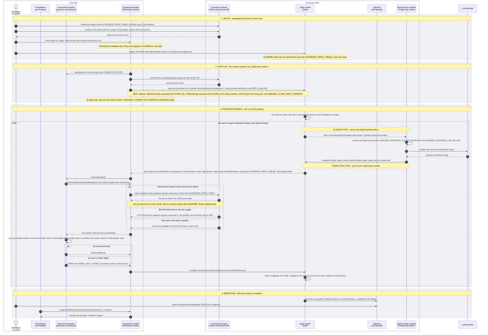

# Token Cost Reporter: connector, Camunda SaaS and secrets, end to end

How the self-hosted connector runtime, Camunda SaaS and the secrets fit together, from the one-time setup to the
Optimize dashboard. Read it left to right: your side on the left, Camunda SaaS in the middle, the LLM provider on the
right. Every connection is opened from your side. The runtime polls Zeebe and asks the Console for secrets; SaaS never
calls in.

The same diagram as an image, for documents: [sequence-diagram.svg](sequence-diagram.svg). Arrows 1-4, 7-8, 12, 18-20 carry a
credential or a secret.

For a user manual there is a one-page A4 version of the main process, the cluster secret from setup to one Token cost
task: [sequence-diagram-a4.svg](sequence-diagram-a4.svg) (sharp, for Word 2016 and later) and
[sequence-diagram-a4.png](sequence-diagram-a4.png) (about 300 dpi, for any Word version).

## Which credential goes where

| Credential | Where it lives | Who reads it | What it is for |
|---|---|---|---|
| API client id and secret | `docker/.env`, passed to the runtime as `CAMUNDA_CLIENT_ID` and `CAMUNDA_CLIENT_SECRET` | the self-hosted runtime only | OAuth tokens: one for the cluster API (jobs), and with the Secrets scope one for `secrets.camunda.io` |
| `GOVERNOR_PRICE_TABLE` cluster secret | Camunda Console, referenced in the BPMN as `{{secrets.GOVERNOR_PRICE_TABLE}}` | the runtime, when the connector binds its variables. The connector never sees Console credentials | the price table (a JSON array). A row here beats the bundled default table for that model |
| `CAMUNDA_PROVIDED_LLM_API_ENDPOINT` and `CAMUNDA_PROVIDED_LLM_API_KEY` | SaaS-only cluster secrets, referenced by the AI Agent elements | the SaaS-hosted runtime only | the AI Agent's LLM calls. Your runtime cannot resolve them, so it does not take AI Agent jobs |

## When it breaks

| What you see | Cause | Fix |
|---|---|---|
| Job fails, the log has a HINT about the audience `secrets.camunda.io`, HTTP 401 | the API client has no Secrets scope | create the client with the Orchestration Cluster API and Secrets scopes |
| Job fails with `SecretNotAvailableException` | `GOVERNOR_PRICE_TABLE` was never created, or the runtime cannot read Console secrets | create it, even as `[]`, and keep `CAMUNDA_CONNECTOR_SECRETPROVIDER_CONSOLE_ENABLED`=true |
| Failed with code 404 while fetching a process definition, health shows `processDefinitionImport` DOWN | the cluster serves its REST API at another address | set `CAMUNDA_CLIENT_REST_ADDRESS` to `https://REGION.api.camunda.io/CLUSTER_ID` |
| BPMN error `PRICE_NOT_FOUND` | no row for `provider:model` in the secret or in the bundled table | add the model to the `GOVERNOR_PRICE_TABLE` secret |
| An AI Agent job fails with "Must be an HTTP or HTTPS URL" and leaves an incident | the self-hosted runtime took the job and cannot resolve `CAMUNDA_PROVIDED_LLM`_* | keep `CAMUNDA_CONNECTOR_AGENTICAI_ENABLED`=false |

## Where this comes from

`docker/docker-compose.yml`, `docker/.env.example`, the Docker deployment section of the README, the two demo BPMN
files and `GovernorConnector.java`. The success path of a secret read with a correctly scoped client is marked in the
diagram because the README says it has not been observed on a live cluster yet.

Generated by `docs/generate-sequence-diagram.py`. Edit the flow there and run the script; do not edit this file or the
SVG by hand. The A4 page comes from `docs/generate-a4-diagram.py` (`--png` also renders the PNG).
